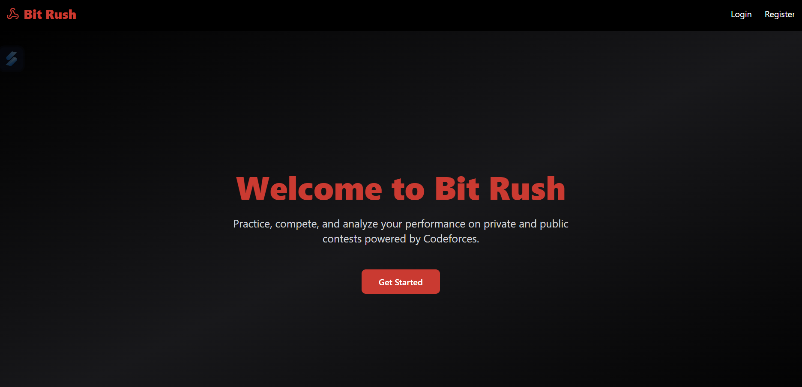
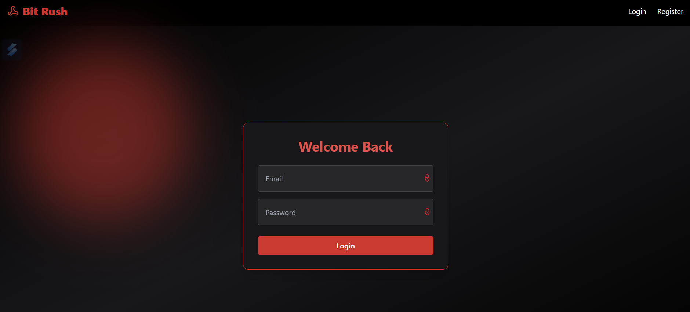

# 🚀 CP-Arena: Competitive Programming Platform

CP-Arena is a full-stack MERN application that enables users to improve their competitive programming skills with custom contests, problem recommendations, real-time tracking, and insightful visualizations.

## 🛠️ Features

- 🔐 **Authentication & Authorization**: JWT-secured login and registration (email/password).
- 📚 **Codeforces Integration**: Fetch problems, user data, rating history, and submissions using the official Codeforces API.
- 🧠 **Intelligent Recommendations**: Filter problems by difficulty, tags, and exclude solved ones.
- ⏱️ **Contest Engine**: Create and join virtual contests with custom durations and automatic start/stop logic.
- 📊 **Analytics Dashboard**: Heatmaps, rating change charts, tag distributions, and performance tracking.
- 🖥️ **Responsive UI**: Designed with Tailwind CSS for optimal usability on all screen sizes.
- 🔄 **Live Updates**: Real-time verdict polling and countdown timers without page refresh.

## ⚙️ Tech Stack

- **Frontend**: React, React Router, Tailwind CSS, Chart.js, React Calendar Heatmap
- **Backend**: Node.js, Express.js, MongoDB, Mongoose
- **Authentication**: JWT, bcrypt
- **APIs**: Codeforces API
- **Deployment**: Render.com

## 📈 Highlights

- Handled ~15+ API endpoints for user, problem, contest, and submission routes.
- Secured over 10 protected API routes with JWT.
- Automated weekly contest reminders via a cron scheduler.
- Served 1000+ problems and tracked 5000+ user submissions dynamically.

## 🚀 Getting Started

### Prerequisites

- Node.js
- MongoDB

### Installation

```bash
# Clone repository
git clone https://github.com/your-username/cp-arena.git

# Install dependencies
cd cp-arena
npm install

# Run client and server
npm run dev
```

### Environment Variables

Create a `.env` file with:

```env
MONGO_URI=your_mongodb_connection_string
JWT_SECRET=your_jwt_secret
```

## 📁 Folder Structure

```
client/             # React frontend
server/             # Express backend
  ├── routes/       # API routes
  ├── controllers/  # Route logic
  ├── models/       # Mongoose models
  └── scheduler/    # Cron jobs
```

## 🧪 Screenshots



## 🌐 Live Demo

Frontend: https://cp-arena-backend-1.onrender.com
Backend: https://cp-arena-backend.onrender.com

## 📌 License

This project is open-sourced for educational purposes.


## 🙋‍♀️ Developed by:

**Kushaan Mahajan**

Feel free to fork this repo and customize it for your learning projects!